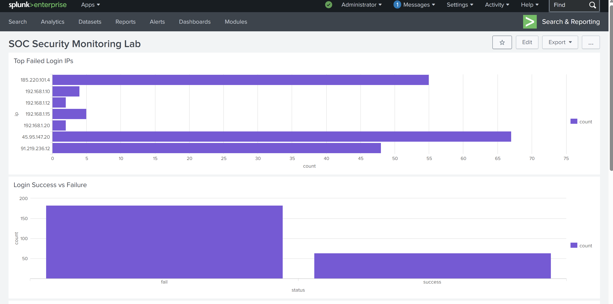
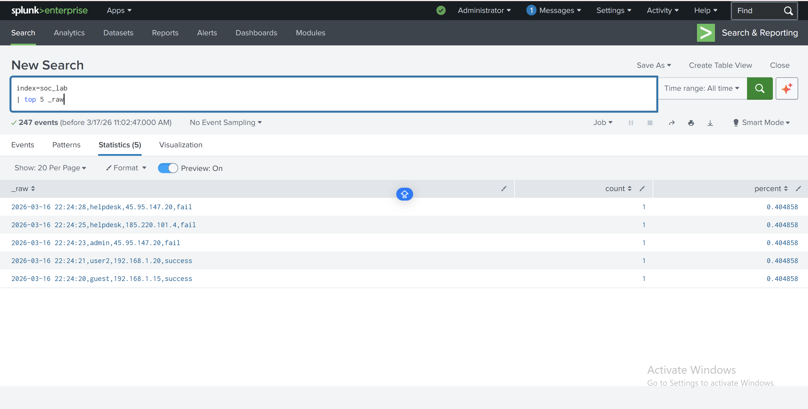
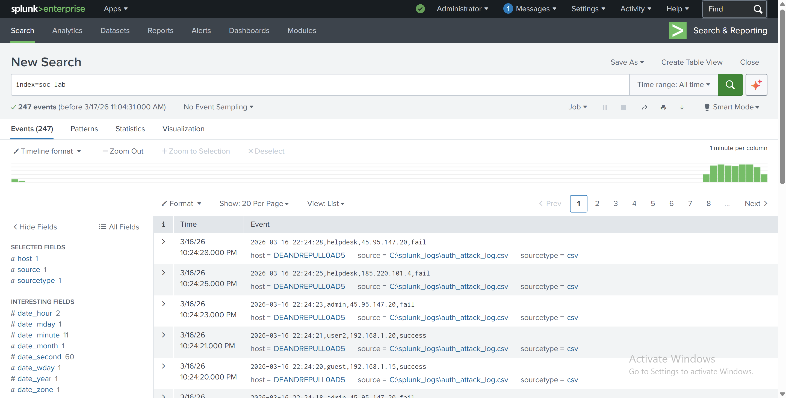

# SOC Brute Force Detection Lab

## Overview
This project simulates a **Security Operations Center (SOC) investigation workflow** by detecting and analyzing a simulated brute-force authentication attack using **Splunk SIEM and Python**.

The lab demonstrates how authentication logs can be ingested into a SIEM platform, analyzed using **Splunk Search Processing Language (SPL)**, and visualized in a **security monitoring dashboard**.

---

## Key Findings

- Detected repeated failed login attempts from a single source IP
- Identified brute-force behavior targeting multiple user accounts
- Observed abnormal authentication volume exceeding normal thresholds
- Successfully simulated and detected attack patterns in real time

## Screenshots

### Dashboard Overview


### Detection Query Results


### Attack Log Events


## Project Architecture

Python Attack Simulator
│
▼
Authentication Log File (CSV)
│
▼
Splunk Log Ingestion
│
▼
Detection Queries (SPL)
│
▼
SOC Monitoring Dashboard
│
▼
Security Incident Investigation


---

## Technologies Used

- Splunk Enterprise (SIEM)
- Python 3
- Splunk SPL
- CSV Log Dataset

---

## Detection Logic

The detection rule identifies suspicious authentication behavior by detecting repeated failed login attempts.

### Example SPL Query

```spl
index=soc_lab
| stats count by username, src_ip
| where count > 5

Project Components
Python Attack Simulator

Generates simulated authentication events to replicate a brute-force attack.

attack_simulator.py

Authentication Log Dataset

Contains simulated login activity including:

Timestamp, Username, Source IP, Login Status, auth_attack_log.csv

Logs are ingested into: soc_lab

SOC Monitoring Dashboard

Dashboard visualizes:

Failed login spikes

Source IP activity

Authentication attempts

Investigation Workflow

Python script generates login attempts

Logs are ingested into Splunk

SPL queries detect suspicious activity

Dashboard visualizes attack patterns

Incident report is created


Files in Repository:
attack_simulator.py
auth_attack_log.csv
soc_incident_report.pdf
soc_monitoring_lab_report.pdf

Skills Demonstrated

SIEM monitoring

Log analysis

SPL query writing

Detection engineering

Security dashboard creation

Python automation

Author

Doc Pulliam
